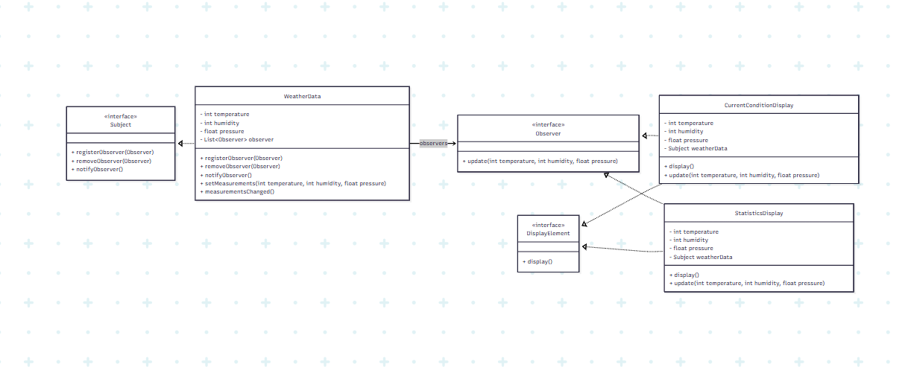
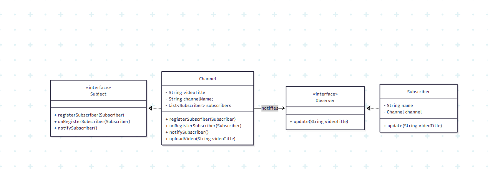

# Observer Pattern

## Intent
Define a one-to-many dependency between objects so that when one object
changes state, all its dependents are notified and updated automatically.

## Intent
Define a one-to-many dependency between objects so that when one object
changes state, all its dependents are notified and updated automatically.


## Solution
Observer pattern decouples the subject from its observers.
Observers register themselves and are notified automatically
when the subject’s state changes.

## When to Use
- When multiple objects depend on a single object
- When changes in one object should trigger updates in others
- When you want loose coupling between objects
- Event-driven systems

## Real-World Examples
- YouTube Channel & Subscribers
- News publisher & readers
- Stock price update systems
- Event listeners in UI frameworks


## UML Class Diagram
Look UML class diagram for Weather Simulator in uml folder.
    
    
```mermaid
---
config:
  layout: dagre
---
classDiagram
    direction LR
    class Subject {
	    + registerObserver(Observer)
	    + removeObserver(Observer)
	    + notifyObserver()
    }

    class WeatherData {
	    - int temperature
        - int humidity
		- float pressure
	    - List~Observer~ observer
	    + registerObserver(Observer)
	    + removeObserver(Observer)
	    + notifyObserver()
	    + setMeasurements(int temperature, int humidity, float pressure)
		+ measurementsChanged()
    }
    class Observer {
	    + update(int temperature, int humidity, float pressure)
    }
	
	class DisplayElement {
	    + display()
    }

    class CurrentConditionDisplay {
	    - int temperature
		- int humidity
		- float pressure
        - Subject weatherData
	    + display()
		+ update(int temperature, int humidity, float pressure)
    }
	
	class StatisticsDisplay {
	    - int temperature
		- int humidity
		- float pressure
        - Subject weatherData
	    + display()
		+ update(int temperature, int humidity, float pressure)
    }

	<<interface>> Subject
	<<interface>> Observer
	<<interface>> DisplayElement

    Subject <|.. WeatherData
    Observer <|.. CurrentConditionDisplay
	Observer <|.. StatisticsDisplay
	DisplayElement <|.. CurrentConditionDisplay
	DisplayElement <|.. StatisticsDisplay
    
    WeatherData --> Observer : observers
    
    
---
config:
  layout: dagre
---
classDiagram
    direction LR
    class Subject {
	    + registerSubscriber(Subscriber)
	    + unRegisterSubscriber(Subscriber)
	    + notifySubscriber()
    }

    class Channel {
	    - String videoTitle
        - String channelName;
	    - List~Subscriber~ subscribers
	    + registerSubscriber(Subscriber)
	    + unRegisterSubscriber(Subscriber)
	    + notifySubscriber()
	    + uploadVideo(String videoTitle)
    }
    class Observer {
	    + update(String videoTitle)
    }

    class Subscriber {
	    - String name
        - Channel channel
	    + update(String videoTitle)
    }

	<<interface>> Subject
	<<interface>> Observer

    Subject <|.. Channel
    Observer <|.. Subscriber
    
    Channel --> Observer : notifies
```

## Participants
- Subject → Maintains observers and sends notifications
- Observer → Receives updates
- ConcreteSubject → Implements Subject (Channel)
- ConcreteObserver → Implements Observer (Subscriber)

## Advantages
- Loose coupling between subject and observers
- Supports Open/Closed Principle
- Dynamic subscription and unsubscription

## Disadvantages
- Unexpected updates if many observers exist
- Notification order is not guaranteed


Example 1: Weather Station


