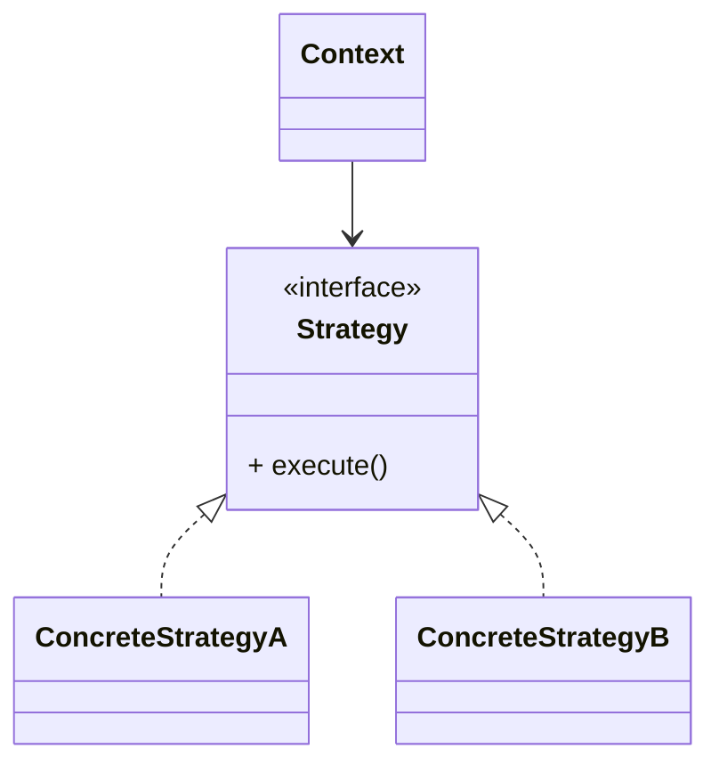
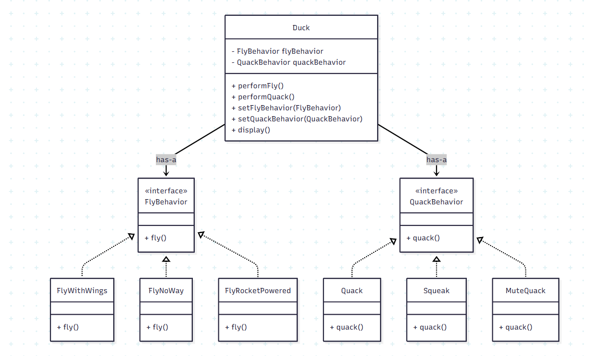

# Strategy Pattern

## Intent
Define a family of algorithms, encapsulate each one, and make them interchangeable. Strategy lets the algorithm vary independently from clients that use it.

## Problem
When behavior changes based on conditions (if-else or switch), the code becomes hard to maintain, hard to extend, and it violates the Open/Closed Principle.

Example (unfriendly conditional logic):

```text
if (type.equals("festival")) {
    price = basePrice * 2;
} else if (type.equals("weekend")) {
    price = basePrice * 1.5;
}
```

## Solution
Extract the changing behavior into separate strategy classes (one class per algorithm). Select or switch the strategy at runtime instead of using conditionals.

## When to Use
- When multiple algorithms exist for the same task
- When you want to avoid large if-else or switch blocks
- When behavior should be changeable at runtime
- When you want to follow the Open/Closed Principle

## Real-World Examples
- Payment methods (Credit Card, UPI, PayPal)
- Sorting strategies (QuickSort, MergeSort)
- Pricing strategies (Normal, Festival, Weekend)
- Duck behaviors (Fly, Quack)

## UML Class Diagram



## Advantages
- Eliminates conditional statements that choose algorithms
- Promotes loose coupling
- Encourages the Single Responsibility Principle
- Easy to add new strategies without modifying the context

## Disadvantages
- Increases the number of classes
- Clients (or a factory) must choose which strategy to use

## Example 1: Duck Simulator

